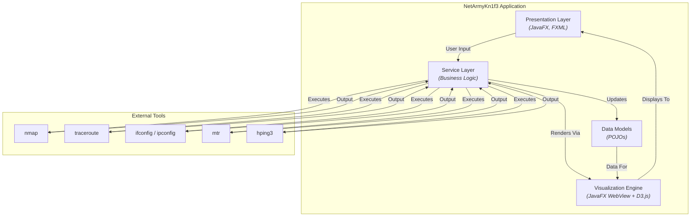

# NetArmyKn1f3: Software Design Document

**Author**: Anna Booker
**Status**: In Progress
**Version**: 1.0

---

## 1. Overview

This document outlines the software design for NetArmyKn1f3, a comprehensive network analysis and visualization suite. The application is a JavaFX-based desktop tool designed for network administrators, cybersecurity professionals, and students. It provides a graphical user interface for complex networking tasks, including network scanning, probing, and topology visualization. The core design philosophy emphasizes modularity, extensibility, and a clean separation of concerns.

## 2. Goals and Non-Goals

### 2.1. Goals

*   **Provide an Integrated Toolset**: Offer a unified interface for common network reconnaissance tasks (host discovery, port scanning, traceroute).
*   **Intuitive Visualization**: Translate complex, text-based network data into interactive, easy-to-understand graphical visualizations.
*   **Cross-Platform Support**: Function consistently across major desktop operating systems (Windows, macOS, Linux).
*   **Extensibility**: Design a modular architecture that allows for the future addition of new tools and features (e.g., live packet capture).
*   **Secure by Default**: Ensure that interactions with the underlying system and network are handled securely.

### 2.2. Non-Goals

*   **Replace Professional Pentesting Tools**: This tool is for analysis and visualization, not for advanced penetration testing or exploitation.
*   **Full Command-Line Equivalence**: The GUI will not expose every possible flag or option of the underlying tools (like `nmap`). It will focus on the most common and useful configurations.
*   **Cloud-Native Operation**: This is designed as a standalone desktop application, not a SaaS or cloud-based service.

## 3. System Architecture

### 3.1. High-Level View

NetArmyKn1f3 is a monolithic desktop application with a modular internal structure. It relies on external, industry-standard command-line tools for its core networking capabilities.

### 3.2. Technology Stack

-   **Core Language**: Java 17
-   **UI Framework**: JavaFX 21 (via OpenJFX)
-   **Dependency Injection**: Google Guice 5.1.0
-   **Build & Dependency Management**: Apache Maven
-   **Visualization Library**: D3.js v7
-   **JSON Processing**: Jackson Databind 2.15.2
-   **Testing**: JUnit 5, Mockito

### 3.3. Directory Structure

The project follows the standard Maven directory layout.

-   `src/main/java`: Core Java source code.
    -   `controllers`: UI logic, mediating between views and services.
    -   `di`: Dependency injection configuration (Guice modules).
    -   `models`: Plain Old Java Objects (POJOs) representing the application's data.
    -   `services`: Core application logic, process management, and data parsing.
    -   `networkprobe`: Classes related to the network probe functionality.
-   `src/main/resources`: Non-code assets.
    -   `styles/fxml`: FXML files defining the UI layout.
    -   `styles/css`: CSS files for styling the application.
-   `pom.xml`: The Maven Project Object Model file, defining the project's dependencies, plugins, and build profiles.

## 4. Component Deep-Dive

This section breaks down the core classes of the application.

#### 4.1. Controllers (`src/main/java/.../controllers`)

-   **`MainWindowController.java`**: The primary controller for the main application window. It manages the tab pane and orchestrates the initialization of the other controllers.
-   **`NetworkScannerController.java`**: Governs the "Network Scanner" tab. It captures user input for scan configurations (CIDR/IP range, scan type), initiates scans via the `NetworkScannerService`, and populates the results table and visualization with the returned `NetworkHost` data. It also handles the bidirectional communication between the results table and the D3.js map.
-   **`NetworkProbeController.java`**: Manages the "Network Probe" tab. It takes a target hostname/IP, allows the user to select between `traceroute` and `mtr` for path analysis, executes the chosen tool via the `SystemToolsManager`, and passes the results to the visualization service.
-   **`SystemInformationController.java`**: (Implicitly from `SystemInformation.fxml`) Backs the "System Information" tab. It queries the `SystemToolsManager` to get local network interface and OS details and displays them in the UI.
-   **`SettingsDialogController.java`**: Handles the settings dialog, allowing users to configure application-level settings, such as paths to external tools (`nmap`, `traceroute`, `mtr`, `hping3`). It interacts with the `SettingsService` to persist these settings.
-   **`PacketCrafterController.java`**: The controller for the new "Packet Crafter" tab. It will be responsible for building and executing `hping3` commands based on user input. *(This controller is currently a placeholder for future development.)*

#### 4.2. Services (`src/main/java/.../services`)

-   **`SystemToolsManager.java`**: A critical service acting as an abstraction layer over command-line executables. It provides a unified API to run external processes like `nmap`, `traceroute`, `mtr`, and `hping3`, capturing their `stdout` and `stderr` streams, managing timeouts, and returning the results as a `QueryResult` object. This isolates the rest of the application from the complexities of process management.
-   **`NetworkScannerService.java`**: Orchestrates the entire network scanning process. It receives a `ScanConfiguration` from the controller, constructs the appropriate `nmap` command-line arguments, executes the command via `SystemToolsManager`, and then parses the resulting XML output into a list of `NetworkHost` model objects.
-   **`NetworkVisualizationService.java`**: The bridge between the Java backend and the D3.js frontend. It loads the HTML/JS/CSS for the visualizations into a `JavaFX WebView`. Its primary role is to serialize Java model objects (like `List<NetworkHost>`) into a JSON string and pass this data to the JavaScript environment to be rendered by D3.js.
-   **`SettingsService.java`**: Manages the loading and saving of application settings. It handles the `settings.properties` file, providing a simple key-value store for persisting configuration data across application sessions.
-   **`PacketCaptureService.java` & `TcpdumpPacketCaptureService.java`**: Represents the foundation for the future "Packet Analyzer" module. It defines an interface for live packet capture and provides an initial implementation using `tcpdump`.

#### 4.3. Models (`src/main/java/.../models`)

-   **`NetworkHost.java`**: A data class representing a single host discovered on the network. It contains fields for IP address, hostname, MAC address, open ports, OS, and status. This is the primary data structure used by the Network Scanner.
-   **`ScanConfiguration.java`**: A model that holds all the user-selected options for a network scan, such as the target specification (CIDR), scan type (Ping, Port, Full), and other boolean flags (e.g., `resolveHostnames`).
-   **`QueryResult.java`**: A simple record used to encapsulate the result of executing an external command, containing the exit code, standard output, and standard error.
-   **`SystemInfo.java`**: A model for storing details about the local system's OS and network interfaces.

## 5. Data Flow

This section details how data moves through the system for typical use cases.

### 5.1. Use Case: Network Scan Execution

This sequence describes the data flow when a user initiates a "Full Scan" from the Network Scanner tab.

1.  **User Interaction**: The user enters a CIDR range (e.g., `192.168.1.0/24`), selects "Full Scan", and clicks the "Start Scan" button.
2.  **Controller Action (`NetworkScannerController`)**: The `onScanButtonClick()` event handler is triggered. The controller reads the values from the UI input fields and constructs a `ScanConfiguration` object.
3.  **Service Invocation**: The controller calls the `performScan(config)` method on the injected `NetworkScannerService`, passing the configuration object. To provide immediate feedback, the UI is updated to show a "Scanning..." state (e.g., progress indicator is shown, scan button is disabled).
4.  **Command Construction (`NetworkScannerService`)**: The service interprets the `ScanConfiguration` object and builds a valid `nmap` command string (e.g., `nmap -sV -O -oX - 192.168.1.0/24`). The `-oX -` flag is crucial as it directs `nmap` to output the results in XML format to standard output.
5.  **Process Execution (`SystemToolsManager`)**: The `NetworkScannerService` invokes the `SystemToolsManager` to execute the constructed `nmap` command. The manager creates a new `Process`, captures its `stdout` and `stderr` streams, and waits for it to complete. It returns the raw XML output and any errors inside a `QueryResult` object.
6.  **XML Parsing (`NetworkScannerService`)**: The service takes the XML string from the `QueryResult` and parses it. It iterates through the XML nodes corresponding to each host, extracting details like IP address, status, ports, and OS information. For each host, it creates and populates a `NetworkHost` object.
7.  **Return to Controller**: The `NetworkScannerService` completes its `Task` and returns a `List<NetworkHost>` to the `NetworkScannerController`.
8.  **UI Update (`NetworkScannerController`)**: The controller receives the list of hosts.
    a.  It populates the `TableView` with the data, creating a new row for each `NetworkHost`.
    b.  It invokes the `NetworkVisualizationService`, passing it the list of hosts.
9.  **Visualization (`NetworkVisualizationService`)**:
    a.  The service serializes the `List<NetworkHost>` into a JSON array string.
    b.  It calls a JavaScript function inside the `WebView` (e.g., `renderGraph(jsonData)`) via `webEngine.executeScript()`.
10. **D3.js Rendering**: The JavaScript code within the `WebView` receives the JSON data. The D3.js library uses this data to render the interactive network map, creating nodes for each host and applying the selected layout (e.g., force-directed).

### 5.2. Use Case: Network Probe (Traceroute)

1.  **User Interaction**: The user enters a hostname (e.g., `google.com`) in the "Network Probe" tab and clicks "Start Probe".
2.  **Controller Action (`NetworkProbeController`)**: The controller retrieves the target string from the input field.
3.  **Service Invocation**: The controller calls the `executeTraceroute(target)` method on the injected `SystemToolsManager`. The UI is updated to indicate the probe is in progress.
4.  **Process Execution (`SystemToolsManager`)**: The manager executes the `traceroute <target>` command, captures the standard output line-by-line, and returns the full output in a `QueryResult` object.
5.  **Data Parsing (`NetworkProbeController`)**: The controller receives the raw output. It processes this text, parsing each line to identify hops, IP addresses, and latency measurements. It builds a data structure (typically a list of hops) representing the path.
6.  **Visualization (`NetworkVisualizationService`)**: The controller passes the parsed hop data to the visualization service, which serializes it to JSON and sends it to the D3.js frontend in the `WebView` for rendering as a topology map.

## 6. User Interface (UI)

The application's UI is partitioned into several FXML files, each representing a distinct view or component. This separation aligns with the Model-View-Controller (MVC) pattern.

-   **`MainWindow.fxml`**: The main application container. It defines the primary window structure, including the main menu and a `TabPane` that holds the other modules. Its controller is `MainWindowController`.
-   **`SystemInformation.fxml`**: The view for the "System Information" tab. It contains labels and text areas to display the local machine's OS and network interface data, providing an at-a-glance dashboard of the local host's configuration.
-   **`NetworkScanner.fxml`**: The view for the "Network Scanner" tab. This is the most complex view, containing input fields for scan configuration, a `TableView` for results, a `WebView` for the D3.js visualization, and controls for interacting with the map (e.g., a dropdown to switch graph layouts). Its controller is `NetworkScannerController`.
-   **`NetworkProbe.fxml`**: The view for the "Network Probe" tab. It includes a text field for the target host, a `ChoiceBox` to select between `Traceroute` and `MTR`, a "Start Probe" button, a `WebView` for the visualization, and a `TextArea` for raw output. Its controller is `NetworkProbeController`.
-   **`PacketAnalyzer.fxml`**: The view for the future "Packet Analyzer" module. It currently serves as a placeholder for future functionality related to live packet capture.
-   **`PacketCrafter.fxml`**: The view for the new "Packet Crafter" tab, designed to provide a user interface for `hping3`. It currently serves as a placeholder.
-   **`SettingsDialog.fxml`**: A modal dialog window for application settings. It provides fields for users to specify paths to required command-line tools (`nmap`, `traceroute`, `mtr`, `hping3`), ensuring the application can locate these external dependencies. Its controller is `SettingsDialogController`.
-   **`ToolInstallationDialog.fxml`**: A helper dialog used to guide the user through the process of installing required tools like `nmap` if they are not found on the system. It improves the first-run user experience by providing actionable guidance.

## 7. Key Architectural Patterns

### 7.1. Dependency Injection (DI)

The application uses Google Guice for dependency injection. This pattern decouples components, making the application easier to test, maintain, and extend. The central configuration is in `di/AppModule.java`, where interfaces are bound to their concrete implementations.

### 7.2. JavaFX-JavaScript Bridge

A critical architectural feature is the communication between the Java backend and the D3.js visualization running inside a `JavaFX WebView`.

-   **Java to JavaScript**: Java calls JavaScript functions using `webEngine.executeScript()`. This is the mechanism by which the `NetworkVisualizationService` passes graph data (as a JSON string) to D3.js for rendering.
-   **JavaScript to Java**: A Java object is exposed to the JavaScript environment via `JSObject.setMember()`. This allows JavaScript event handlers (e.g., `onClick` on a D3 node) to call back into Java methods, enabling features like map-to-table selection synchronization.

## 8. Security Considerations

As an application that executes system commands and interacts with the network, security is a primary concern. This section outlines key risks and the design choices made to mitigate them.

### 8.1. Command Injection

-   **Risk**: The application constructs and executes command-line strings based on user input (e.g., scan targets). A malicious user could attempt to inject additional commands or arguments (e.g., `8.8.8.8; rm -rf /`).
-   **Mitigation**:
    1.  **Input Validation**: User input for scan targets and probe hosts is validated. The `NetworkScannerService` and `NetworkProbeController` are responsible for sanitizing this input. While the current implementation relies on the external tools' own parsing, a more robust implementation would use strict regular expressions to validate IP addresses, hostnames, and CIDR notation before they are passed to the command line.
    2.  **Argument Separation**: The `SystemToolsManager` should ideally be refactored to accept a list of arguments (`List<String>`) rather than a single command string. This allows the Java `ProcessBuilder` to handle the arguments safely, preventing shell metacharacters from being interpreted. *This is a recommended future enhancement.*

### 8.2. Resource Exhaustion (Denial of Service)

-   **Risk**: A user could initiate a very broad or intensive scan (e.g., scanning a `/8` CIDR block or a highly aggressive `nmap` scan) that consumes excessive CPU, memory, or network bandwidth, potentially making the application or the host system unresponsive.
-   **Mitigation**:
    1.  **Asynchronous Execution**: All network operations are performed on background threads using JavaFX `Task`s. This keeps the UI responsive and prevents the application from freezing during long-running scans.
    2.  **No Hard Limits**: The application does not currently impose hard limits on scan scope. It is assumed the user is a trusted operator who understands the impact of their actions. For a more general-purpose tool, implementing warnings or limits for very large scans would be a necessary addition.

### 8.3. Sensitive Information Disclosure

-   **Risk**: The application could potentially leak sensitive information either in logs or through improper handling of command output.
-   **Mitigation**:
    1.  **Settings Storage**: Application settings (like the path to `nmap`) are stored in a properties file in a user-specific directory (`~/.netarmykn1f3/settings.properties`). This follows the principle of least privilege by not writing to system-wide locations.
    2.  **Logging**: Logging is performed using SLF4J. The current configuration does not log raw command output by default, minimizing the risk of sensitive network information being written to disk in plain text.

### 8.4. External Tool Vulnerabilities

-   **Risk**: The application's security is dependent on the security of the command-line tools it invokes (`nmap`, `traceroute`). A vulnerability in one of these underlying tools could be exploited through this application.
-   **Mitigation**:
    1.  **User Responsibility**: The design delegates the responsibility of keeping these tools up-to-date to the user. The application provides guidance on how to install them but does not manage their versions.
    2.  **Clear Indication**: The settings panel allows the user to specify the path to these tools, making it clear which executables are being used.

## 9. Build and Deployment

The project is built using Apache Maven. It is configured to produce self-contained native installers for Windows, macOS, and Linux using the `jpackage` tool. For detailed instructions, see the main `README.md` file.

--- 