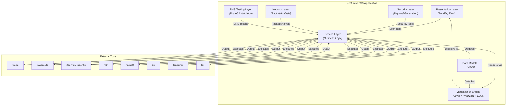

# NetArmyKn1f3: Software Design Document

**Author**: Anna Booker  
**Status**: Complete  
**Version**: 2.0  

---

## 1. Overview

This document outlines the software design for NetArmyKn1f3, a comprehensive network analysis, security testing, and DNS routing policy validation suite. The application is a JavaFX-based desktop tool designed for network administrators, cybersecurity professionals, penetration testers, and students. It provides a graphical user interface for complex networking tasks, including network scanning, probing, topology visualization, packet analysis, DNS routing validation, and advanced security testing. The core design philosophy emphasizes modularity, extensibility, and a clean separation of concerns.

## 2. Goals and Non-Goals

### 2.1. Goals

*   **Provide an Integrated Toolset**: Offer a unified interface for common network reconnaissance tasks (host discovery, port scanning, traceroute, packet analysis, DNS testing).
*   **Intuitive Visualization**: Translate complex, text-based network data into interactive, easy-to-understand graphical visualizations.
*   **Cross-Platform Support**: Function consistently across major desktop operating systems (Windows, macOS, Linux).
*   **Extensibility**: Design a modular architecture that allows for the future addition of new tools and features.
*   **Secure by Default**: Ensure that interactions with the underlying system and network are handled securely.
*   **Advanced Security Testing**: Provide enterprise-grade security testing capabilities with sophisticated payload generation.
*   **DNS Routing Validation**: Comprehensive testing of Route53 routing policies with high-volume analysis.
*   **Real-Time Packet Analysis**: Live network traffic monitoring and protocol dissection.

### 2.2. Non-Goals

*   **Replace Professional Pentesting Tools**: This tool is for analysis and visualization, not for advanced penetration testing or exploitation.
*   **Full Command-Line Equivalence**: The GUI will not expose every possible flag or option of the underlying tools (like `nmap`). It will focus on the most common and useful configurations.
*   **Cloud-Native Operation**: This is designed as a standalone desktop application, not a SaaS or cloud-based service.

## 3. System Architecture

### 3.1. High-Level View

NetArmyKn1f3 is a monolithic desktop application with a modular internal structure. It relies on external, industry-standard command-line tools for its core networking capabilities.

### 3.2. Technology Stack

-   **Core Language**: Java 17
-   **UI Framework**: JavaFX 21 (via OpenJFX)
-   **Dependency Injection**: Google Guice 5.1.0
-   **Build & Dependency Management**: Apache Maven
-   **Visualization Library**: D3.js v7
-   **JSON Processing**: Jackson Databind 2.15.2
-   **Testing**: JUnit 5, Mockito
-   **Security Testing**: Custom payload generation with enterprise-grade encoding
-   **DNS Testing**: High-volume DNS query testing with statistical analysis
-   **Packet Analysis**: Real-time packet capture and protocol dissection

### 3.3. Directory Structure

The project follows the standard Maven directory layout.

-   `src/main/java`: Core Java source code.
    -   `controllers`: UI logic, mediating between views and services.
    -   `di`: Dependency injection configuration (Guice modules).
    -   `models`: Plain Old Java Objects (POJOs) representing the application's data.
    -   `services`: Core application logic, process management, and data parsing.
    -   `networkprobe`: Classes related to the network probe functionality.
-   `src/main/resources`: Non-code assets.
    -   `styles/fxml`: FXML files defining the UI layout.
    -   `styles/css`: CSS files for styling the application.
-   `pom.xml`: The Maven Project Object Model file, defining the project's dependencies, plugins, and build profiles.

## 4. Component Deep-Dive

This section breaks down the core classes of the application.

#### 4.1. Controllers (`src/main/java/.../controllers`)

-   **`MainWindowController.java`**: The primary controller for the main application window. It manages the tab pane and orchestrates the initialization of the other controllers.
-   **`NetworkScannerController.java`**: Governs the "Network Scanner" tab. It captures user input for scan configurations (CIDR/IP range, scan type), initiates scans via the `NetworkScannerService`, and populates the results table and visualization with the returned `NetworkHost` data. It also handles the bidirectional communication between the results table and the D3.js map.
-   **`NetworkProbeController.java`**: Manages the "Network Probe" tab. It takes a target hostname/IP, allows the user to select between `traceroute` and `mtr` for path analysis, executes the chosen tool via the `SystemToolsManager`, and passes the results to the visualization service.
-   **`SystemInformationController.java`**: (Implicitly from `SystemInformation.fxml`) Backs the "System Information" tab. It queries the `SystemToolsManager` to get local network interface and OS details and displays them in the UI.
-   **`PacketAnalyzerController.java`**: Manages the "Packet Analyzer" tab. It handles real-time packet capture using `tcpdump`, protocol dissection, traffic visualization, and export capabilities. It provides live monitoring of network traffic with interactive charts and filtering options.
-   **`PacketCrafterController.java`**: Manages the "Packet Crafter" tab. It provides custom packet generation and manipulation capabilities, allowing users to create packets with specific headers, payloads, and flags for network testing and security research.
-   **`Route53TestingController.java`**: Manages the "Route53 Testing" tab. It handles comprehensive DNS routing policy testing including high-volume testing (10,000+ queries), geographic testing with Tor integration, statistical analysis, and real-time monitoring of DNS routing policies.
-   **`AwsFirewallTesterController.java`**: Manages the "Firewall Rule Tester" tab. It provides advanced security testing capabilities with sophisticated payload generation, response analysis, and real-time testing dashboard with live progress tracking.
-   **`SettingsDialogController.java`**: Handles the settings dialog, allowing users to configure application-level settings, such as paths to external tools (`nmap`, `traceroute`, `mtr`, `hping3`, `dig`, `tcpdump`). It interacts with the `SettingsService` to persist these settings.
-   **`ToolInstallationDialog.java`**: A helper dialog used to guide the user through the process of installing required tools like `nmap` if they are not found on the system. It improves the first-run user experience by providing actionable guidance.

#### 4.2. Services (`src/main/java/.../services`)

-   **`SystemToolsManager.java`**: A critical service acting as an abstraction layer over command-line executables. It provides a unified API to run external processes like `nmap`, `traceroute`, `mtr`, `hping3`, `dig`, and `tcpdump`, capturing their `stdout` and `stderr` streams, managing timeouts, and returning the results as a `QueryResult` object. This isolates the rest of the application from the complexities of process management.
-   **`NetworkScannerService.java`**: Orchestrates the entire network scanning process. It receives a `ScanConfiguration` from the controller, constructs the appropriate `nmap` command-line arguments, executes the command via `SystemToolsManager`, and then parses the resulting XML output into a list of `NetworkHost` model objects.
-   **`NetworkVisualizationService.java`**: The bridge between the Java backend and the D3.js frontend. It loads the HTML/JS/CSS for the visualizations into a `JavaFX WebView`. Its primary role is to serialize Java model objects (like `List<NetworkHost>`) into a JSON string and pass this data to the JavaScript environment to be rendered by D3.js.
-   **`PacketCaptureService.java`**: Manages real-time packet capture using `tcpdump`. It provides live network traffic monitoring, protocol dissection, and traffic visualization capabilities. It supports advanced filtering and export options for captured packets.
-   **`TcpdumpPacketCaptureService.java`**: Implementation of packet capture using `tcpdump` with real-time analysis and protocol identification.
-   **`ProtocolDissectorService.java`**: Analyzes captured packets to identify and classify network protocols (HTTP, HTTPS, DNS, DHCP, ARP, ICMP).
-   **`Route53ResolverTestingService.java`**: Handles high-volume DNS testing with statistical analysis. It performs large-scale DNS queries (10,000+) for accurate weighted routing analysis and provides detailed distribution analysis.
-   **`Route53RoutingPolicyTestingService.java`**: Manages complex routing policy testing including geolocation testing with Tor integration, latency-based routing validation, and failover testing. It provides comprehensive DNS routing policy validation capabilities.
-   **`TorProxyService.java`**: Manages Tor integration for geographic diversity testing. It provides access to Tor exit nodes for testing geolocation-based routing policies from multiple geographic locations.
-   **`AwsFirewallTestingService.java`**: Orchestrates advanced security testing with sophisticated payload generation and response analysis. It provides enterprise-grade security testing capabilities with concurrent execution and detailed effectiveness scoring.
-   **`FirewallPayloadGenerator.java`**: Generates sophisticated attack payloads with multiple encoding variations including SQL injection, XSS, command injection, path traversal, and TLS fragmentation testing.
-   **`SettingsService.java`**: Manages the loading and saving of application settings. It handles the `settings.properties` file, providing a simple key-value store for persisting configuration data across application sessions.

#### 4.3. Models (`src/main/java/.../models`)

-   **`NetworkHost.java`**: A data class representing a single host discovered on the network. It contains fields for IP address, hostname, MAC address, open ports, OS, and status. This is the primary data structure used by the Network Scanner.
-   **`ScanConfiguration.java`**: A model that holds all the user-selected options for a network scan, such as the target specification (CIDR), scan type (Ping, Port, Full), and other boolean flags (e.g., `resolveHostnames`).
-   **`QueryResult.java`**: A simple record used to encapsulate the result of executing an external command, containing the exit code, standard output, and standard error.
-   **`SystemInfo.java`**: A model for storing details about the local system's OS and network interfaces.
-   **`CapturedPacket.java`**: Represents a captured network packet with metadata including timestamp, source/destination addresses, protocol information, and payload data.
-   **`Route53ResolverTest.java`**: Represents the results of a DNS resolver test including query details, response information, and statistical data.
-   **`Route53RoutingPolicyTest.java`**: Represents comprehensive DNS routing policy test results including endpoint distribution, geographic testing results, and policy compliance analysis.
-   **`AwsFirewallConfiguration.java`**: Configuration model for firewall testing including target URLs, payload categories, and testing parameters.
-   **`FirewallTestResult.java`**: Represents the results of individual firewall tests including payload details, response analysis, and effectiveness scoring.

## 5. Data Flow

This section details how data moves through the system for typical use cases.

### 5.1. Use Case: Network Scan Execution

This sequence describes the data flow when a user initiates a "Full Scan" from the Network Scanner tab.

1.  **User Interaction**: The user enters a CIDR range (e.g., `192.168.1.0/24`), selects "Full Scan", and clicks the "Start Scan" button.
2.  **Controller Action (`NetworkScannerController`)**: The `onScanButtonClick()` event handler is triggered. The controller reads the values from the UI input fields and constructs a `ScanConfiguration` object.
3.  **Service Invocation**: The controller calls the `performScan(config)` method on the injected `NetworkScannerService`, passing the configuration object. To provide immediate feedback, the UI is updated to show a "Scanning..." state (e.g., progress indicator is shown, scan button is disabled).
4.  **Command Construction (`NetworkScannerService`)**: The service interprets the `ScanConfiguration` object and builds a valid `nmap` command string (e.g., `nmap -sV -O -oX - 192.168.1.0/24`). The `-oX -` flag is crucial as it directs `nmap` to output the results in XML format to standard output.
5.  **Process Execution (`SystemToolsManager`)**: The `NetworkScannerService` invokes the `SystemToolsManager` to execute the constructed `nmap` command. The manager creates a new `Process`, captures its `stdout` and `stderr` streams, and waits for it to complete. It returns the raw XML output and any errors inside a `QueryResult` object.
6.  **XML Parsing (`NetworkScannerService`)**: The service takes the XML string from the `QueryResult` and parses it. It iterates through the XML nodes corresponding to each host, extracting details like IP address, status, ports, and OS information. For each host, it creates and populates a `NetworkHost` object.
7.  **Return to Controller**: The `NetworkScannerService` completes its `Task` and returns a `List<NetworkHost>` to the `NetworkScannerController`.
8.  **UI Update (`NetworkScannerController`)**: The controller receives the list of hosts.
    a.  It populates the `TableView` with the data, creating a new row for each `NetworkHost`.
    b.  It invokes the `NetworkVisualizationService`, passing it the list of hosts.
9.  **Visualization (`NetworkVisualizationService`)**:
    a.  The service serializes the `List<NetworkHost>` into a JSON array string.
    b.  It calls a JavaScript function inside the `WebView` (e.g., `renderGraph(jsonData)`) via `webEngine.executeScript()`.
10. **D3.js Rendering**: The JavaScript code within the `WebView` receives the JSON data. The D3.js library uses this data to render the interactive network map, creating nodes for each host and applying the selected layout (e.g., force-directed).

### 5.2. Use Case: Route53 High-Volume Testing

This sequence describes the data flow when a user initiates a high-volume DNS routing policy test.

1.  **User Interaction**: The user enters a domain name, selects "WEIGHTED" routing policy, sets iterations to 10,000, and clicks "Start Route53 Test".
2.  **Controller Action (`Route53TestingController`)**: The controller constructs a `Route53RoutingPolicyTest` configuration object with the test parameters.
3.  **Service Invocation**: The controller calls the `performHighVolumeTest(config)` method on the `Route53RoutingPolicyTestingService`.
4.  **DNS Query Execution**: The service executes 10,000 `dig` commands in batches, using `SystemToolsManager` to manage the process execution.
5.  **Statistical Analysis**: The service analyzes the DNS responses, calculating endpoint distribution, deviation from expected weights, and success rates.
6.  **Real-Time Updates**: The controller receives progress updates and updates the UI with live statistics and charts.
7.  **Results Compilation**: The service compiles comprehensive results including distribution analysis, compliance checking, and detailed statistics.
8.  **UI Update**: The controller updates multiple tabs with results, charts, and export options.

### 5.3. Use Case: Packet Analysis

This sequence describes the data flow when a user initiates real-time packet capture.

1.  **User Interaction**: The user configures packet capture filters and clicks "Start Capture".
2.  **Controller Action (`PacketAnalyzerController`)**: The controller constructs capture parameters and initiates the packet capture process.
3.  **Service Invocation**: The controller calls the `startCapture(config)` method on the `PacketCaptureService`.
4.  **Process Execution**: The service executes `tcpdump` with the specified filters using `SystemToolsManager`.
5.  **Real-Time Processing**: The service processes captured packets in real-time, using `ProtocolDissectorService` to identify protocols.
6.  **Data Modeling**: Each packet is converted to a `CapturedPacket` object with metadata and analysis results.
7.  **Visualization**: The controller updates traffic charts and statistics in real-time.
8.  **Export Options**: Users can export captured packets in PCAP format for external analysis.

### 5.4. Use Case: Security Testing

This sequence describes the data flow when a user initiates advanced security testing.

1.  **User Interaction**: The user configures firewall testing parameters and selects payload categories.
2.  **Controller Action (`AwsFirewallTesterController`)**: The controller constructs an `AwsFirewallConfiguration` object.
3.  **Payload Generation**: The `FirewallPayloadGenerator` creates sophisticated attack payloads with multiple encoding variations.
4.  **Concurrent Testing**: The `AwsFirewallTestingService` executes payloads concurrently, monitoring responses and analyzing effectiveness.
5.  **Response Analysis**: The service analyzes HTTP status codes, response content, timing patterns, and connection behavior.
6.  **Real-Time Dashboard**: The controller updates the testing dashboard with live progress and results.
7.  **Effectiveness Scoring**: The service calculates effectiveness scores and generates detailed reports.

## 6. User Interface (UI)

The application's UI is partitioned into several FXML files, each representing a distinct view or component. This separation aligns with the Model-View-Controller (MVC) pattern.

-   **`MainWindow.fxml`**: The main application container. It defines the primary window structure, including the main menu and a `TabPane` that holds the other modules. Its controller is `MainWindowController`.
-   **`SystemInformation.fxml`**: The view for the "System Information" tab. It contains labels and text areas to display the local machine's OS and network interface data, providing an at-a-glance dashboard of the local host's configuration.
-   **`NetworkScanner.fxml`**: The view for the "Network Scanner" tab. This is the most complex view, containing input fields for scan configuration, a `TableView` for results, a `WebView` for the D3.js visualization, and controls for interacting with the map (e.g., a dropdown to switch graph layouts). Its controller is `NetworkScannerController`.
-   **`NetworkProbe.fxml`**: The view for the "Network Probe" tab. It includes a text field for the target host, a `ChoiceBox` to select between `Traceroute` and `MTR`, a "Start Probe" button, a `WebView` for the visualization, and a `TextArea` for raw output. Its controller is `NetworkProbeController`.
-   **`PacketAnalyzer.fxml`**: The view for the "Packet Analyzer" module. It provides real-time packet capture interface with filter configuration, traffic visualization charts, protocol statistics, and export options. Its controller is `PacketAnalyzerController`.
-   **`PacketCrafter.fxml`**: The view for the "Packet Crafter" tab. It provides custom packet generation interface with protocol selection, payload configuration, rate limiting controls, and response analysis. Its controller is `PacketCrafterController`.
-   **`Route53Testing.fxml`**: The view for the "Route53 Testing" tab. It provides comprehensive DNS routing policy testing interface with high-volume testing capabilities, geographic testing options, statistical analysis, and real-time monitoring. Its controller is `Route53TestingController`.
-   **`AwsFirewallTester.fxml`**: The view for the "Firewall Rule Tester" tab. It provides advanced security testing interface with payload configuration, real-time testing dashboard, response analysis, and effectiveness scoring. Its controller is `AwsFirewallTesterController`.
-   **`SettingsDialog.fxml`**: A modal dialog window for application settings. It provides fields for users to specify paths to required command-line tools (`nmap`, `traceroute`, `mtr`, `hping3`, `dig`, `tcpdump`), ensuring the application can locate these external dependencies. Its controller is `SettingsDialogController`.
-   **`ToolInstallationDialog.fxml`**: A helper dialog used to guide the user through the process of installing required tools like `nmap` if they are not found on the system. It improves the first-run user experience by providing actionable guidance.

## 7. Key Architectural Patterns

### 7.1. Dependency Injection (DI)

The application uses Google Guice for dependency injection. This pattern decouples components, making the application easier to test, maintain, and extend. The central configuration is in `di/AppModule.java`, where interfaces are bound to their concrete implementations.

### 7.2. JavaFX-JavaScript Bridge

A critical architectural feature is the communication between the Java backend and the D3.js visualization running inside a `JavaFX WebView`.

-   **Java to JavaScript**: Java calls JavaScript functions using `webEngine.executeScript()`. This is the mechanism by which the `NetworkVisualizationService` passes graph data (as a JSON string) to D3.js for rendering.
-   **JavaScript to Java**: A Java object is exposed to the JavaScript environment via `JSObject.setMember()`. This allows JavaScript event handlers (e.g., `onClick` on a D3 node) to call back into Java methods, enabling features like map-to-table selection synchronization.

### 7.3. Concurrent Processing

The application uses JavaFX `Task` and `Service` classes for concurrent processing of network operations, security testing, and DNS queries. This ensures the UI remains responsive during long-running operations.

### 7.4. Real-Time Data Processing

Advanced features like packet analysis and Route53 testing use real-time data processing patterns with streaming updates to the UI.

## 8. Security Considerations

As an application that executes system commands and interacts with the network, security is a primary concern. This section outlines key risks and the design choices made to mitigate them.

### 8.1. Command Injection

-   **Risk**: The application constructs and executes command-line strings based on user input (e.g., scan targets). A malicious user could attempt to inject additional commands or arguments (e.g., `8.8.8.8; rm -rf /`).
-   **Mitigation**:
    1.  **Input Validation**: User input for scan targets and probe hosts is validated. The `NetworkScannerService` and `NetworkProbeController` are responsible for sanitizing this input. While the current implementation relies on the external tools' own parsing, a more robust implementation would use strict regular expressions to validate IP addresses, hostnames, and CIDR notation before they are passed to the command line.
    2.  **Argument Separation**: The `SystemToolsManager` should ideally be refactored to accept a list of arguments (`List<String>`) rather than a single command string. This allows the Java `ProcessBuilder` to handle the arguments safely, preventing shell metacharacters from being interpreted. *This is a recommended future enhancement.*

### 8.2. Resource Exhaustion (Denial of Service)

-   **Risk**: A user could initiate a very broad or intensive scan (e.g., scanning a `/8` CIDR block or a highly aggressive `nmap` scan) that consumes excessive CPU, memory, or network bandwidth, potentially making the application or the host system unresponsive.
-   **Mitigation**:
    1.  **Asynchronous Execution**: All network operations are performed on background threads using JavaFX `Task`s. This keeps the UI responsive and prevents the application from freezing during long-running scans.
    2.  **No Hard Limits**: The application does not currently impose hard limits on scan scope. It is assumed the user is a trusted operator who understands the impact of their actions. For a more general-purpose tool, implementing warnings or limits for very large scans would be a necessary addition.

### 8.3. Sensitive Information Disclosure

-   **Risk**: The application could potentially leak sensitive information either in logs or through improper handling of command output.
-   **Mitigation**:
    1.  **Settings Storage**: Application settings (like the path to `nmap`) are stored in a properties file in a user-specific directory (`~/.netarmykn1f3/settings.properties`). This follows the principle of least privilege by not writing to system-wide locations.
    2.  **Logging**: Logging is performed using SLF4J. The current configuration does not log raw command output by default, minimizing the risk of sensitive network information being written to disk in plain text.

### 8.4. External Tool Vulnerabilities

-   **Risk**: The application's security is dependent on the security of the command-line tools it invokes (`nmap`, `traceroute`, `dig`, `tcpdump`). A vulnerability in one of these underlying tools could be exploited through this application.
-   **Mitigation**:
    1.  **User Responsibility**: The design delegates the responsibility of keeping these tools up-to-date to the user. The application provides guidance on how to install them but does not manage their versions.
    2.  **Clear Indication**: The settings panel allows the user to specify the path to these tools, making it clear which executables are being used.

### 8.5. Security Testing Considerations

-   **Risk**: The security testing features could potentially be used maliciously or cause unintended effects on target systems.
-   **Mitigation**:
    1.  **Educational Purpose**: The application is designed for educational and testing purposes only.
    2.  **User Responsibility**: Users are responsible for ensuring they have proper authorization before testing any systems.
    3.  **Rate Limiting**: Security tests include configurable rate limiting to prevent overwhelming target systems.

## 9. Build and Deployment

The project is built using Apache Maven. It is configured to produce self-contained native installers for Windows, macOS, and Linux using the `jpackage` tool. For detailed instructions, see the main `README.md` file.

---

## 10. Advanced Features

### 10.1. Route53 Testing Architecture

The Route53 testing module provides comprehensive DNS routing policy validation with the following key components:

-   **High-Volume Testing**: Support for 10,000+ DNS queries with statistical analysis
-   **Geographic Testing**: Tor integration for testing geolocation-based routing policies
-   **Real-Time Monitoring**: Live progress tracking and result updates
-   **Statistical Analysis**: Detailed breakdown of actual vs expected endpoint distribution
-   **Export Capabilities**: Multiple output formats for external analysis

### 10.2. Packet Analysis Architecture

The packet analysis module provides real-time network traffic monitoring with the following key components:

-   **Live Capture**: Real-time packet capture using `tcpdump` with customizable filters
-   **Protocol Dissection**: Automatic identification and analysis of common protocols
-   **Traffic Visualization**: Interactive charts showing packet distribution
-   **Advanced Filtering**: Custom filter expressions for targeted analysis
-   **Export Options**: PCAP format export for external tool integration

### 10.3. Security Testing Architecture

The security testing module provides enterprise-grade security testing capabilities with the following key components:

-   **Sophisticated Payload Generation**: Multiple attack categories with encoding variations
-   **Concurrent Testing**: Parallel execution of security tests for efficiency
-   **Response Analysis**: Intelligent analysis of HTTP responses and behavior patterns
-   **Effectiveness Scoring**: Quantitative assessment of security test results
-   **Real-Time Dashboard**: Live progress tracking and result visualization

---

*This design document provides a comprehensive overview of the NetArmyKn1f3 architecture, covering all major components and their interactions. The modular design ensures extensibility and maintainability while providing powerful network analysis, security testing, and DNS validation capabilities.* 