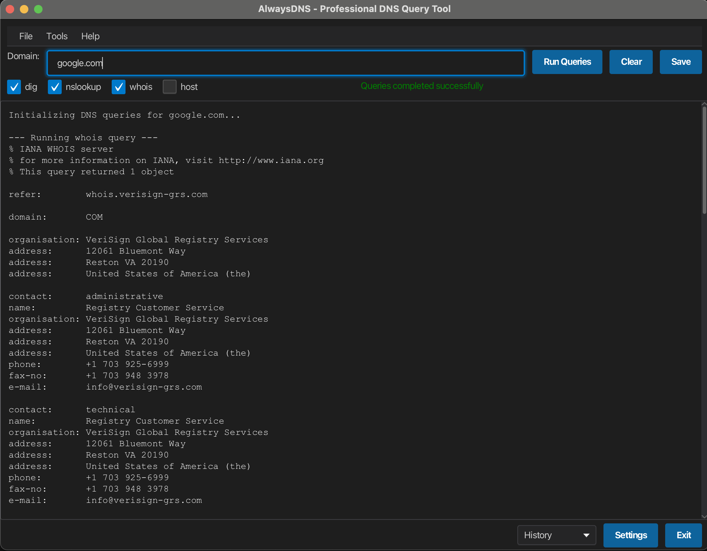

# AlwaysDNS – Professional DNS Query Tool

## Inspiration
I often bounce between command-line utilities (dig, nslookup, whois, host) when I’m troubleshooting DNS issues. Switching contexts is slow and the output is messy. AlwaysDNS wraps the four common tools into a single, cross-platform GUI so anyone—sysadmin or student—can fire off look-ups quickly and keep results in one place.

## Vision
* One window to run the most common DNS look-ups in parallel.
* Detect missing command-line tools and guide the user to install them.
* Store recent domains and user preferences (theme, time-out, history size).
* Export results, copy to clipboard, dark-theme visuals.
* Future: tabs for concurrent domains, graph view, Python plug-ins for custom analysis.

## Basic Functionality (implemented)
1. Enter a domain, choose which queries to run (dig / nslookup / whois / host) and click **Run Queries** or press **F5**.
2. Results stream into the console-style area; progress bar & status update live.
3. Save results to a text file or clear the pane.
4. History combo stores the last 20 domains.
5. **Settings** dialog lets you adjust time-out, history size, theme, font, etc.
6. **Tools ▸ Manage Tools** opens a dialog that checks for required CLI tools and helps install them.
7. Menu shortcuts:  
   * ⌘,  Settings  
   * ⌘T Manage Tools  
   * ⌘Q Quit  
   * F1 About

## Features still under construction
* Graphical diff view between successive queries.
* Portable installation of missing CLI tools on Windows.
* Multiple tabs for parallel domains.

## How to Build / Run
```bash
# compile & launch
./mvnw javafx:run

# or build a self-contained image
./mvnw javafx:jlink
./target/app/bin/app   # run the image
```
Java 17+ and Maven Wrapper are included; no manual setup needed.

## Screenshot
  
*Running dig/nslookup/whois in parallel*

## Control & UI Checklist
| UI element | Type |
|------------|------|
| Domain input | `TextField` |
| Run, Clear, Save | `Button` (×3) |
| Query checkboxes | `CheckBox` (×4) |
| History | `ComboBox` |
| Progress bar | `ProgressBar` |
| Status | `Label` |
| Results | `TextArea` |
| Menu items | `MenuBar / Menu / MenuItem` |

*14 controls, 6 distinct control types.*

## Style
`terminal.css` provides a dark palette and blue accent buttons; menus inherit the theme automatically.

---
© 2025 AlwaysDNS 